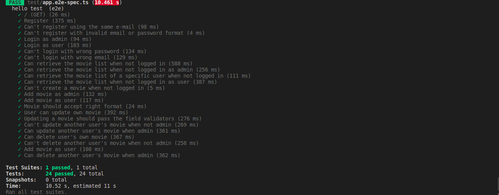

<p align="center"> <a >C4T INTERVIEW </a>
    <p align="center">

</p>

## Description

Nest js Interview 

## Setup
### Installation

```bash
$ npm install
```

### Running the app

```bash
# development
$ npm run start

# watch mode
$ npm run start:dev

# production mode
$ npm run start:prod
```

### Test

```bash

# e2e tests
$ npm run test:e2e

```
> **NOTE :**  Create development.env file which contains the same variable as .env.sample 


# Details
## Structure
#### The backend consists of 3 Modules :

- Auth module responsible for login and sign up user , compares the user's information against entries in a database to meet the authentication criteria.
- User module responsible for profile management.
- Movie module than contains CRUD functionalities

## Abstract Concept

- Even though it's a prototype-oriented  TypeScript, most of the elements are based on objects, and it utilizes Object-Oriented Programming (OOP) in its own ways.

- So an abstract module is implemented containing an abstract controller, Service (contains methods), and Schema.

- All modules inherit from abstract module to use common methods that will always be improved and modified with time in  order to have less  , clearer and readable code.


## E2E Testing

- A test suit for Auth is implemented to test the authentication scenarios 
- A test suit for movie is implemented to test different scenarios 


```bash
$ npm run test:e2e
```
####  Output :

<p align="center">
  <a href="http://nestjs.com/" target="blank"></a>
</p>

## Swagger

[http://localhost:3000/docs](http://localhost:3000/docs)

## Postman
Postman json file in the racine of project

## Have a great weekend, I'm looking forward to meeting you !
